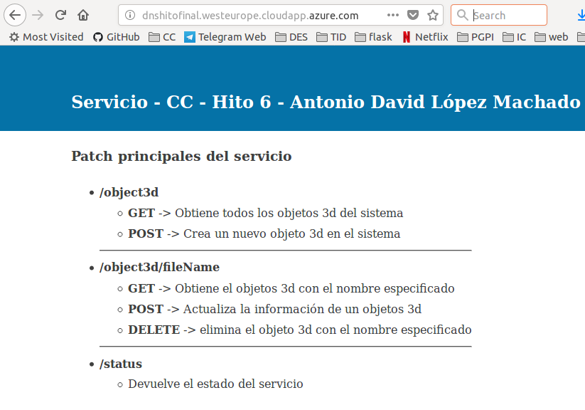

## Composición de servicios

### Introducción

La imagen utilizada ha sido una imagen alpine([link](https://hub.docker.com/r/frolvlad/alpine-python3/)) con python3 y pip3 instalados. He utilizado esta imagen por dos motivos. El primer motivo es su peso de 61mb aproximadamente lo cual me permite una mayor flexibilidad.El segundo motivo es que tenga preinstalado los paquetes de python3 y pip3 los cuales son utilizados en mi proyecto.

Para esta composición de servicios se iba a realizar con el gestor de ficheros S3 de amazon, pero debido a no tener el presupuesto suficiente para ello se ha decidido utilizar la segunda opción que se barajó en el comienzo de este proyecto. Dicha segunda opción era utilizar mongoDB para el almacenamiento de los objetos 3D. Se ha utilizado este enfoque en esta práctica ya que tras profundizar en las caracteristicas de mongoDB ([link](https://www.mongodb.com/blog/post/storing-large-objects-and-files-in-mongodb)) he podido llegar a la conclusión de que es una opción tan válida como la del uso de un gestor de ficheros como el ya mencionado S3 de amazon. Además, de esta forma puedo realizar una composición del servicio principal del proyecto y del servicio de mongoDB.

Se ha utilizado la plataforma azure ya que me ha permitido utilizar mi composición de servicios de una manera rápida y sin ninguna dificultad.


### Instalaciones requeridas

Se ha realizado la instalación de docker compose en su versión 1.1.8. Para ello se ha realizado el siguiente comando:

```
sudo curl -L https://github.com/docker/compose/releases/download/1.18.0/docker-compose-`uname -s`-`uname -m` -o /usr/local/bin/docker-compose
sudo chmod +x /usr/local/bin/docker-compose
```

### Descripción del hito

#### Creación de la composición de servicios
Para crear la composición de servicios es tan sencillo como una vez creado tanto los dockerfiles correspondientes como el docker-compose debemos utilizar la siguiente instrucción
```
sudo docker-compose up
```

#### Despliegue en azure de la composición de servicios
Para ello he utilizado las propias herramientas de azure. Azure me permite crear una maquina virtual la cual ya tiene docker y docker-compose instalados. Para la creación de la máquina virtual:
```
az group deployment create --resource-group ccGroup \
    --template-uri https://raw.githubusercontent.com/Azure/azure-quickstart-templates/master/docker-simple-on-ubuntu/azuredeploy.json
```
Tras esto nos pedirá un conjunto de datos como el nombre de la cuenta, nombre del dns,el usuario root y su contraseña. Tras introducir la información creara la maquina virtual y para conectar con ella sera tan sencillo como:
```
ssh antoniolm@dnshitofinal.westeurope.cloudapp.azure.com
```

Y como podemos ver en la maquina virtual, docker-compose ya esta instalado


Ahora realizamos la instalación de git y clonamos el repositorio para poder tener acceso a nuestro proyecto.
```
sudo apt-get install git
git clone https://github.com/Antoniolm/Master-CC.git
```

Una vez realizado esto nos vamos a la raiz del repositorio clonado y lanzamos la composición de servicios.

```
sudo docker-compose up -d
```
Tras esto el servicio estará activo


