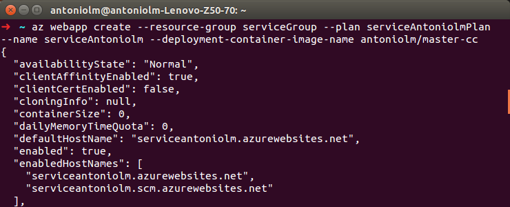
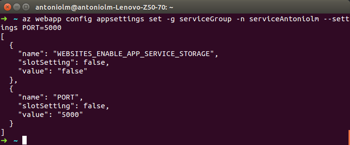
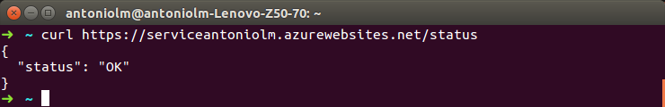

## Contenedores

### Introducción

La imagen utilizada ha sido una imagen alpine([link](https://hub.docker.com/r/frolvlad/alpine-python3/)) con python3 y pip3 instalados. He utilizado esta imagen por dos motivos. El primer motivo es su peso de 61mb aproximadamente lo cual me permite una mayor flexibilidad.El segundo motivo es que tenga preinstalado los paquetes de python3 y pip3 los cuales son utilizados en mi proyecto.

Se ha utilizado la plataforma azure ya que me ha permitido utilizar mi imagen pública de dockerhub de una manera rápida y sin ninguna dificultad.


### Instalaciones requeridas

Se ha realizado la instalación de docker en su versión estable 1.6.2. Para hecho se ha realizado el siguiente comando:

```
sudo apt-get install docker docker.io
```

### Descripción del hito

#### Creación de la imagen docker
Debemos crear la imagen a partir de nuestro dockerfile, para ello debemos enlazar nuestro repositorio de Github con Dockerhub para asi poder crear automaticamente nuestra imagen.

Tras esto podremos acceder a nuestra imagen a través de dockerHub con el enlace:
https://hub.docker.com/r/antoniolm/master-cc

#### Despliegue en azure de la imagen docker

Primero creamos un deployment user:
```
az webapp deployment user set --user-name antoniolm --password $pass
```

Creamos un grupo nuevo para nuestros servicios :
```
az group create --name serviceGroup --location "West Europe"
```

Tras esto debemos crear el plan de nuestro servicio:
```
az appservice plan create --name serviceAntoniolmPlan --resource-group serviceGroup --sku S1 --is-linux

```
Una vez tengamos listo nuestro plan podemos crear nuestra web app service con nuestra imagen subida a dockerHUB. El comando para ello es:
```
az webapp create --resource-group serviceGroup --plan serviceAntoniolmPlan --name serviceAntoniolm --deployment-container-image-name antoniolm/master-cc

```


Por último, debemos añadir a nuestro servicio la key PORT para indicar el puerto que usará el servicio. Para ello:
```
az webapp config appsettings set -g serviceGroup -n serviceAntoniolm --settings PORT=5000
```



Una vez realizado todo esto podemos comprobar que nuestro servicio nos devuelve un status ok:


