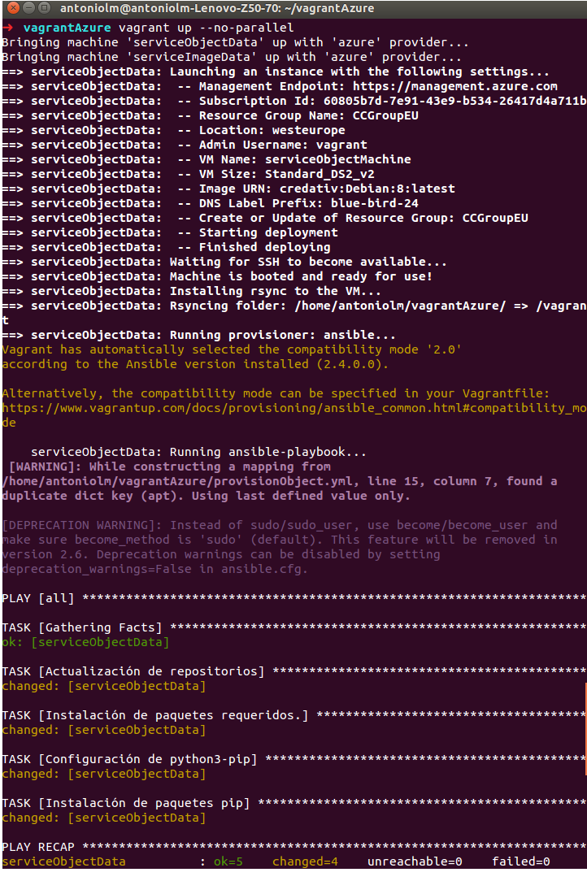
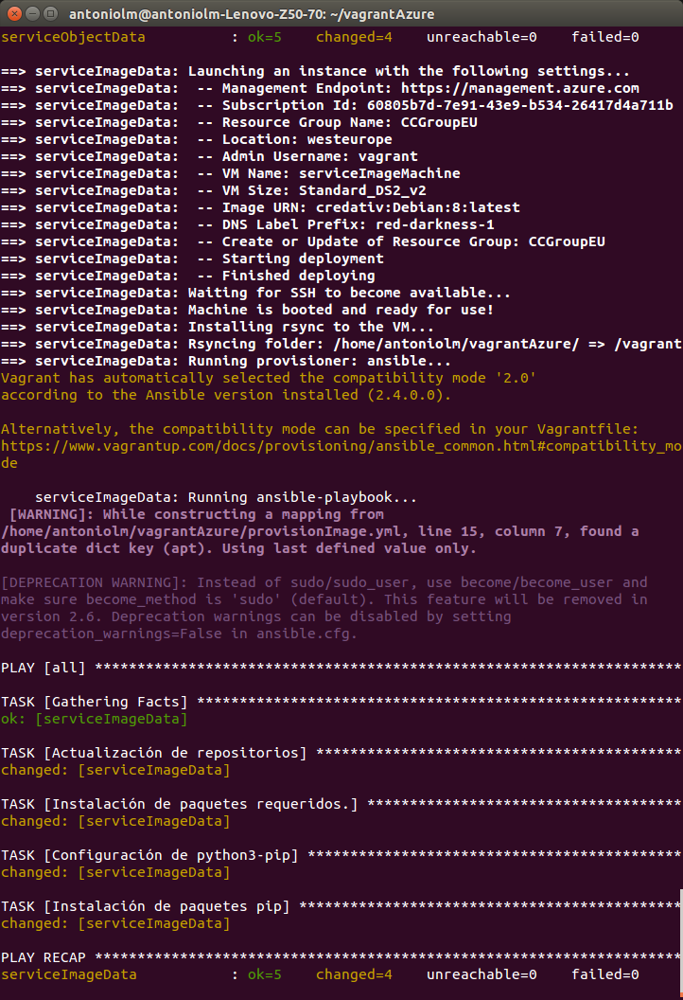

## Orquestación

### Introducción

La orquestación se ha realizado utilizando vagrant junto con el cliente de azure. He seleccionado este cliente ya que permitía obtener la información necesaria para vangrant de una forma sencilla y en unos pocos pasos he podido realizar mis primeras orquestaciones.

He utilizado una imagen Debian porque tras investigar varias distribuciones de linux descubri que es una de las más ligeras y además es más segura y tiene un mejor rendimiento que otras distribuciones. Además, en el aspecto de personalización del sistema operativo supera en mucho a otras distribuciones. Todos estos aspectos me han hecho decantarme por esta distribuciones frente a otras distribuciones como centos o ubuntu.

### Instalaciones requeridas
Antes de comenzar a realizar el provisionamiento debemos instalar en nuestra máquina la aplicación ansible y el cliente de azure para ello podemos consultar el readme del hito de automatización -> [link](https://github.com/Antoniolm/Master-CC/blob/master/automatizacion/README.md)

Esta vez nos centraremos en como instalar vagrant y el plugin para el uso de azure desde vagrant.

Para la instalación de vagrant me he decantado por instalar su última versión (2.0.1) ya que la versión estable era la 1.4 y para utilizar el plugin de azure necesita una versión mayor. He descargado y instalado el paquete deb que contenía esta versión desde la página oficial de [vagrant](https://www.vagrantup.com/downloads.html).

Para el plugin de azure me he decantado por su versión 2.0.0, para instalarlo debemos introducir el siguiente comando:
```
vagrant plugin install vagrant-azure --plugin-version '2.0.0.pre6'
```

### Descripción de la orquestación
El primer paso es realizar nuestro logeo en el cliente de azure (az login).
A continuación debemos introducir en las variables de entorno la información de nuestra cuenta de azure en nuestro vagrantFile. Para ello tenemos que realizar los siguientes comandos:

```
az ad sp create-for-rbac
az account list --query "[?isDefault].id" -o tsv
```
El primero es para obtener los parámetros : tenant id, client secret, client id . El segundo nos provee de la id de nuestra subscripción

A continuación debemos añadir la máquina de azure para ello:
```
vagrant box add azure https://github.com/azure/vagrant-azure/raw/v2.0/dummy.box --provider azure
```

Una vez realizado todo esto solo nos falta levantar las máquinas virtuales indicadas en nuestro fichero Vagrantfile. Se ha utilizado el argumento **--no-parallel** porque azure no trabaja correctamente de forma paralela.
```
vagrant up --no-parallel
```

Como podemos ver en las imágenes hemos podido orquestar múltiples máquinas virtuales a la vez correctamente.



